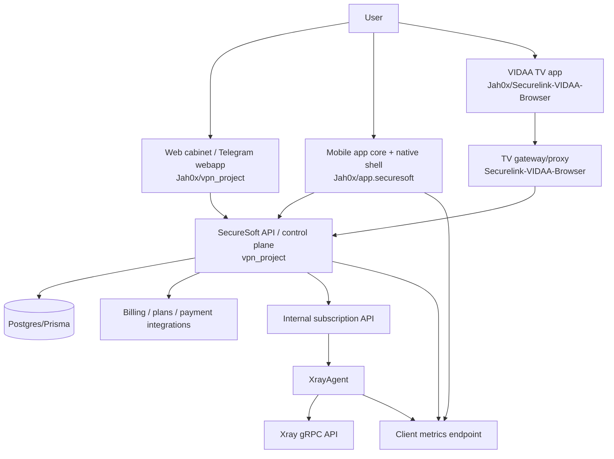

# SecureSoft Project Map

Last updated: 2026-07-05

This document is the high-level map for the SecureSoft project across GitHub repositories. Use it before opening code in an AI agent/Codex session so the agent does not waste context reading unrelated repositories.

## Goal

SecureSoft should be treated as a multi-repository product, not as one chaotic app. The product is a secure connectivity platform with a personal cabinet, subscription management, VPN provisioning, Xray synchronization, mobile clients, Smart TV access and support/diagnostics.

## Repository ownership

| Repository | Role | Current status | Should be used for |
| --- | --- | --- | --- |
| `Jah0x/vpn_project` | Main product repository: personal cabinet, web UI, Telegram webapp, server API, billing/subscriptions, Hanko auth, deployment scripts | Main source of truth for the web/backend product | Product decisions, backend API, subscription domain, deployment docs, cross-repo architecture |
| `Jah0x/app.securesoft` | TypeScript mobile core for Android/iOS VPN app | Core logic exists; not a complete production mobile app by itself | Mobile business logic, API contracts, VPN state machine, metrics, push, update/security/support modules |
| `Jah0x/XrayAgent` | Sync agent between internal subscription API and Xray gRPC HandlerService/StatsService | Specialized runtime component | Xray user sync, webhook/delta/full sync, Xray metrics, agent deployment |
| `Jah0x/Securelink-VIDAA-Browser` | Smart TV / VIDAA HTML5 client plus TV gateway/proxy | Separate client surface for TV devices | TV device-code binding, TV browser/gateway flows, proxy-over-tunnel experiments |
| `Jah0x/Vpn-v2` | Early FastAPI + Telegram bot skeleton | Legacy/reference only unless explicitly revived | Ideas/reference; do not treat as active source of truth without migration plan |
| `Jah0x/secure-memory` | Private markdown workspace for personal memory agent | Not runtime product code | Private notes only; keep separate from production decisions unless manually promoted into docs |

## Source-of-truth rules

1. `vpn_project` is the product/control-plane source of truth.
2. `app.securesoft` consumes product APIs and owns mobile client-side behavior.
3. `XrayAgent` must not own subscriptions. It only mirrors subscription state from internal APIs into Xray.
4. `Securelink-VIDAA-Browser` must not own account/billing. It binds TV devices through the SecureSoft account/control plane.
5. `Vpn-v2` is not authoritative. If code or API ideas are needed from it, first create a migration issue and copy the final decision into `vpn_project/docs/`.
6. Secrets, demo credentials, server IPs and real tokens must not be copied into AI prompts, docs, issues or PR comments.

## Product domains

| Domain | Owner repo | Notes |
| --- | --- | --- |
| Authentication/session | `vpn_project` | Hanko/JWT/session refresh. Mobile should align to these contracts. |
| Billing/subscriptions/plans | `vpn_project` | Plan management, subscription state, payment/onramp integration, user limits. |
| VPN identity/provisioning | `vpn_project` + `XrayAgent` | `vpn_project` decides who should have access; `XrayAgent` applies it to Xray. |
| Mobile app core | `app.securesoft` | Auth, device registration, VPN token flow, metrics, push, update policy. |
| Native mobile VPN bridge | `app.securesoft` or separate native repo | Needs explicit adapter contracts for Android VpnService and iOS Network Extension. |
| Smart TV access | `Securelink-VIDAA-Browser` | Device code flow, TV UI, gateway/proxy behavior. |
| Observability/metrics | `vpn_project`, `app.securesoft`, `XrayAgent` | Metrics must be consistent across backend, mobile and agent. |
| Support/AI diagnostics | `vpn_project` + `app.securesoft` | Must redact secrets and avoid user traffic content. |

## Target runtime picture

## Development order

1. Stabilize `vpn_project` as the control plane.
2. Define API contracts that mobile and TV consume.
3. Keep Xray operations behind `XrayAgent`; avoid direct Xray writes from UI/client code.
4. Integrate `app.securesoft` with real backend contracts after API shape is frozen.
5. Add TV device binding only after account/device/subscription ownership is clear.

## What to do when adding a module

Every module must have:

- one owner repo;
- one owner domain;
- input/output contracts;
- storage ownership;
- test command;
- rollback plan;
- docs update in `docs/`;
- explicit list of files an AI agent should read before editing it.

Use `docs/AI_MODULE_DEVELOPMENT_GUIDE.md` for the detailed module workflow.
